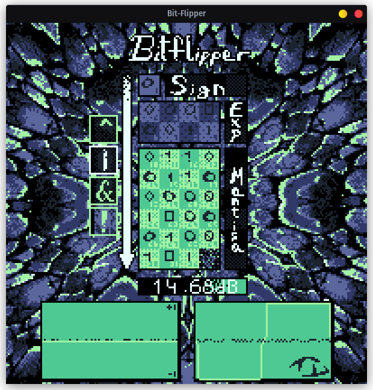
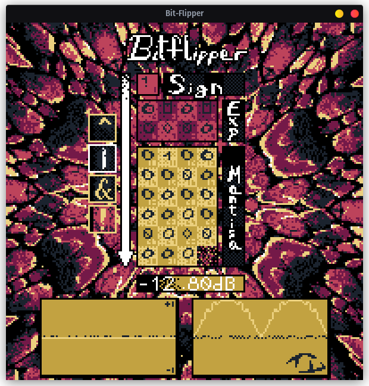
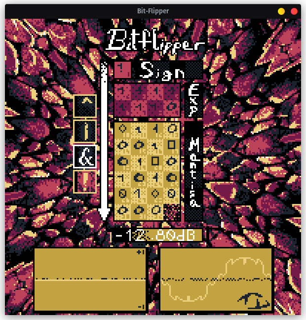
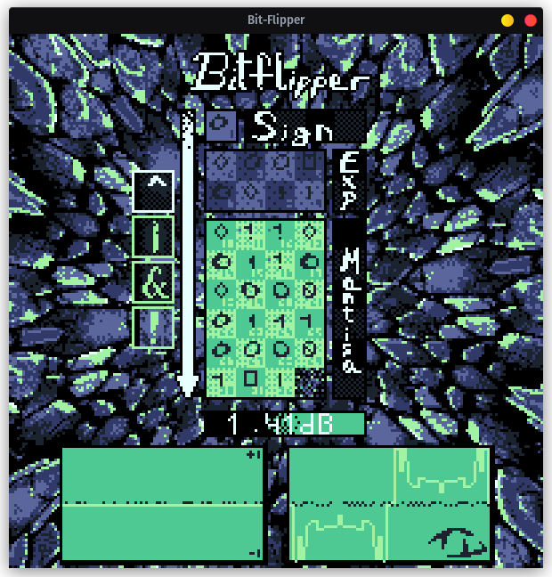

# Bit Flipper

> [!WARNING]
> Flipping the most significant bits, or just using the "!" mode, **WILL lead to very large DC offsets**.

A very simple distortion plugin that performs direct bit manipulation on audio samples, made with [nih-plug](https://github.com/robbert-vdh/nih-plug) and [Wgpu](https://wgpu.rs/).

<div align="center">
  
  
  
  
</div>

## Custom themes support !
```text
(Linux) $XDG_CONFIG_HOME/bit_flipper/
(Windows) %APPDATA%\bit_flipper\
(macOS) ~/Library/Application Support/bit_flipper/
````

* On Linux, this typically resolves to `~/.config/bit_flipper/`.
* On Windows, it will use the standard AppData folder.

⚠️ **Sandboxed environments (Flatpak, Snap, etc.)** may redirect the config directory to a sandbox path.
For example, when running inside Flatpak, the textures may be stored under:

```text
/var/app/com.bitwig.BitwigStudio/config/bit_flipper/
```

## Tested on:

- ⣴⠶⣦ Bitwig on Pop!\_OS 22.04 🐧
- 🥕 FL Studio on Windows 10 🪟

<hr>

> [!NOTE]
> I honestly thought it would sound more interesting 😭, but no.

It operates in four modes:

- **&** AND
- **!** NOT (doesn't use the bit mask)
- **|** OR
- **^** XOR

Can it be useful? I guess so? _Well, maybe if you're remaking "On Sight" by Kanye._
Flipping the first fraction bits can add subtle noise to the sound.

### Download

Open the Actions tab and click on the most recent one that hasn't failed. Then, download the version for your operating system.

> [!IMPORTANT]
> You need a GitHub account to access these files.

### License

GPL-3.0-or-later
